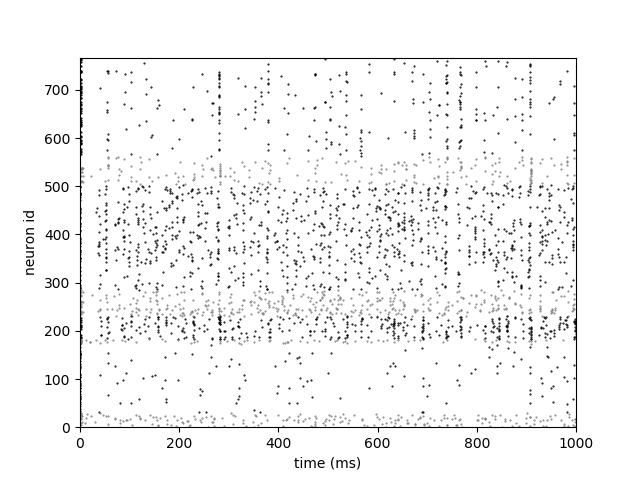
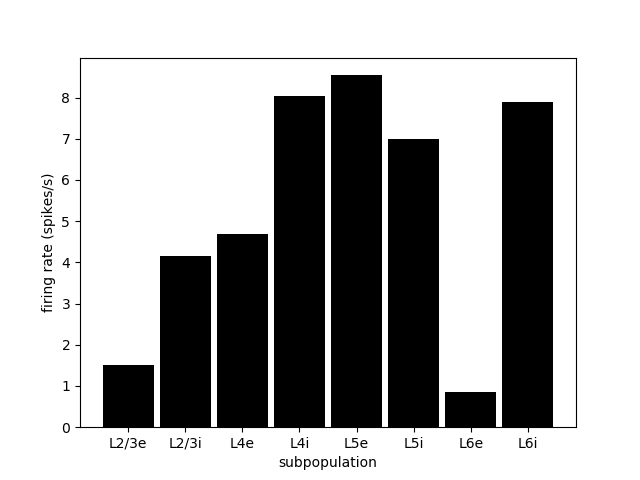
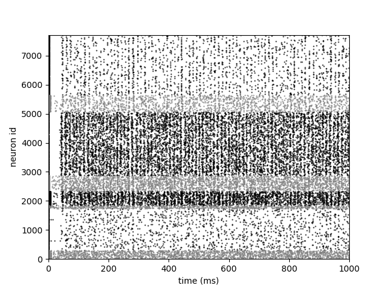
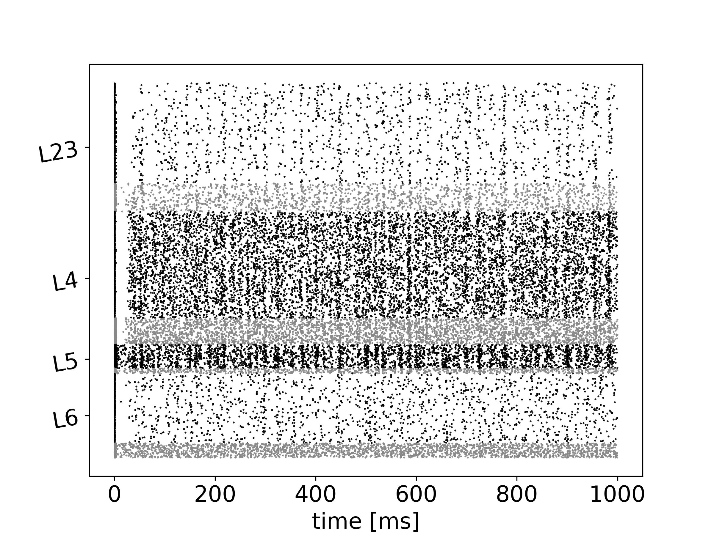
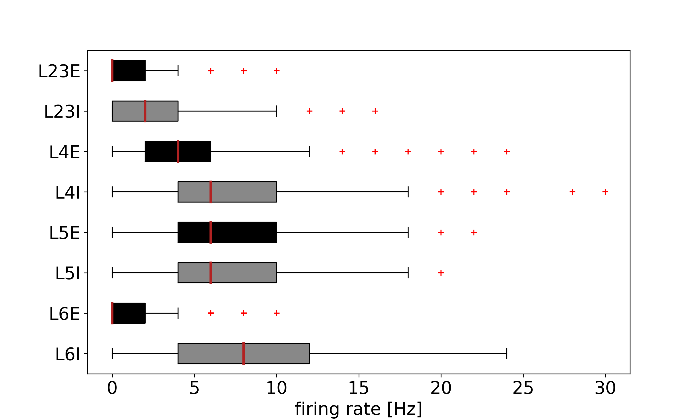
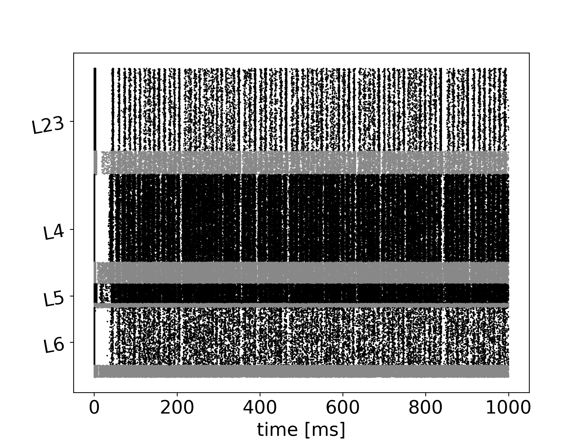
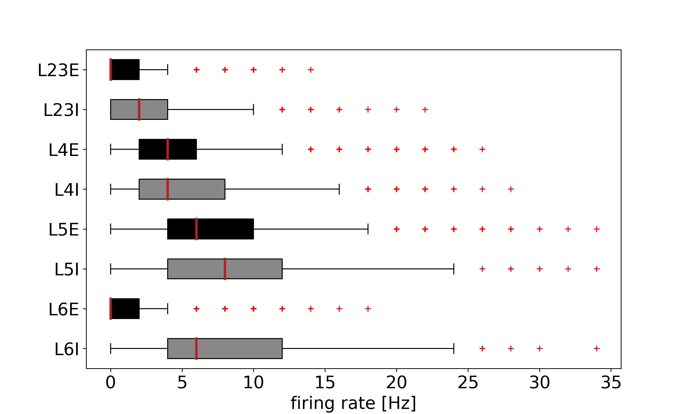
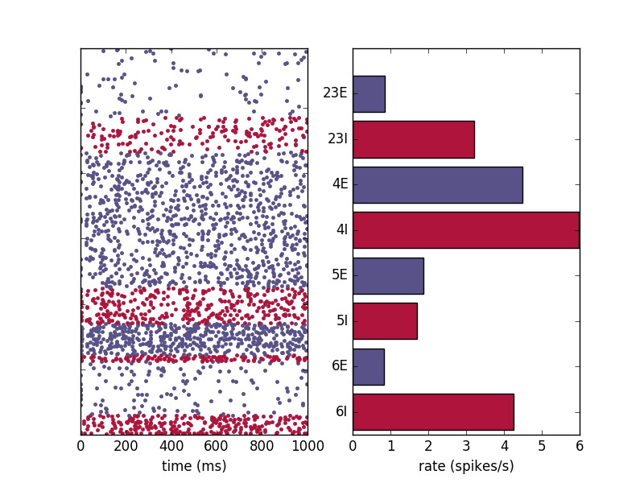

## Comparison of model behaviour across implementations

### NEST SLI

The model was originally implemented in [NEST SLI format](/NEST_SLI) (taken from [here](https://github.com/nest/nest-simulator/tree/master/examples/nest/Potjans_2014)). 

**10% scaled down version**

Note 1: 10% of cells recorded & plotted on left. 
Note 2: rasterplot includes first 200ms to enable comparison between implementations at startup, but firing rates are calculated on 200-1000ms.
<table>
<tr>
<td></td>
<td></td>
</tr>
</table>

**Full scale version**
<table>
<tr>
<td></td>
<td></td>
</tr>
</table>

### PyNEST

**10% scaled down version**
<table>
<tr>
<td></td>
<td></td>
</tr>
</table>

**Full scale version**
<table>
<tr>
<td></td>
<td></td>
</tr>
</table>

### PyNN: NEST

<table>
<tr>
<td></td>
</tr>
</table>